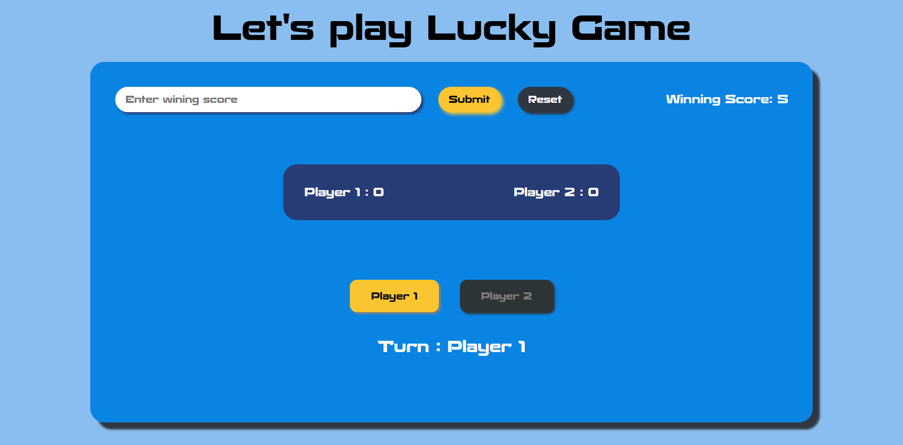

# 🥳 Lucky Player

This is a simple, fast-paced two-player game built using HTML, CSS, and JavaScript. The goal is to see which player can reach the winning score the fastest.

## 🌟 Features

- 🏆 Two-player mode: Both players compete to react faster and react to the goal.
- 🎯 Customizable Winning Score: Players can set and reset the winning score at any time.
- 🔊 Sound Effects: Enjoy typing, clicking, and clapping sound effects for a more engaging experience.
- 💻 Responsive Design: The game is optimized for all devices – from desktops to smartphones.
- ♻️ Reset Functionality: Reset scores and values for a fresh start anytime.

## Screenshots



## Tech Stack

- HTML5 for structuring the page.
- CSS3 for designing a responsive layout.
- JavaScript (ES6) for game logic and interactivity.

## Demo Link

A live demo can be found [here](https://abdur-rahman-apu.github.io/Lucky-Game/)

## Installation

1.  Clone the repository:

```bash
git clone https://github.com/Abdur-Rahman-Apu/Lucky-Game.git
```

2.  Open index.html in your browser to play the game.

## How to Play

1. Set the winning score.
2. Players click their respective buttons as fast as possible.
3. The first player to match the winning score is declared the winner with a celebratory sound effect.

## Credits

This project was created as part of the [JavaScript Ninja Bootcamp](https://webdeveloperbd.net/js-bootcamp/).
